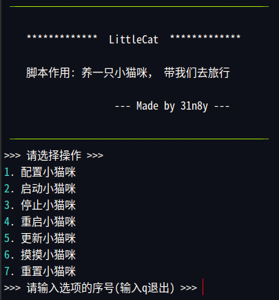

# LittleCat

```
 ──────────────────────────────────────────────

    *************  LittleCat  *************

    脚本作用: 养一只小猫咪，带我们去旅行
    
                    --- Made by 31n8y ---
    
 ──────────────────────────────────────────────
```

## 使用

```bash
git clone https://github.com/31n8y/LittleCat.git

cd LittleCat

sudo bash LittleCat.sh
```



## 功能

1. 配置小猫咪: 配置小猫咪订阅地址，仪表板密码，启动小猫咪服务器IP地址
2. 启动小猫咪: 根据配置的小猫咪订阅地址，自动启动小猫咪服务
3. 停止小猫咪: 停止小猫咪服务
4. 重启小猫咪: 停止小猫咪服务后启动小猫咪服务
5. 更新小猫咪: 根据配置的小猫咪订阅地址，自动下载更新小猫咪配置文件
6. 摸摸小猫咪: 摸一摸小猫咪，它会告诉你关于它的信息
7. 重置小猫咪: 恢复小猫咪出厂设置

## 参考

1. [clash-for-linux](https://github.com/wnlen/clash-for-linux)
2. [subconverter](https://github.com/tindy2013/subconverter)
3. [yacd](https://github.com/haishanh/yacd)